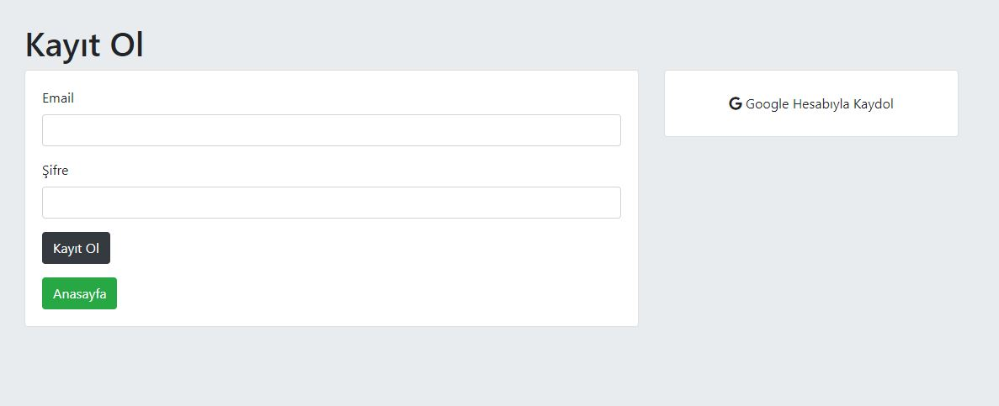
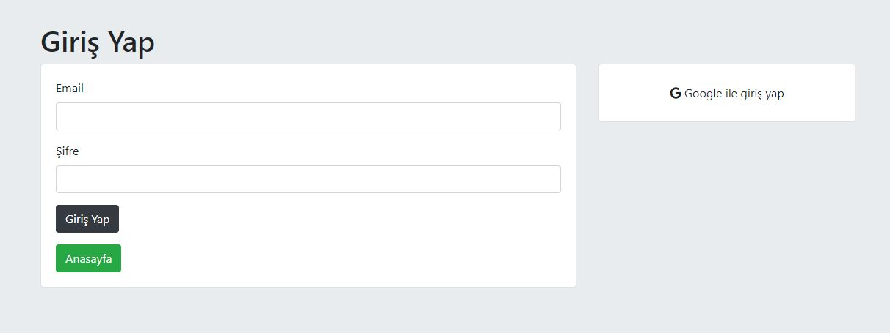

# Guvenlik

### HomePage


### Register


### Login



## Installation

```
$ git clone https://github.com/SedatBasaran14/guvenlik.git
$ cd guvenlik
$ npm install
$ npm start
```

#### Guvenlik
I created the register and login pages on this site. In addition to these, I used the feature of logging in with google and storing passwords in the database in a more secure way. I used MongoDB as a database.
